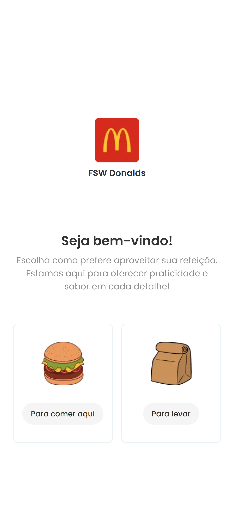
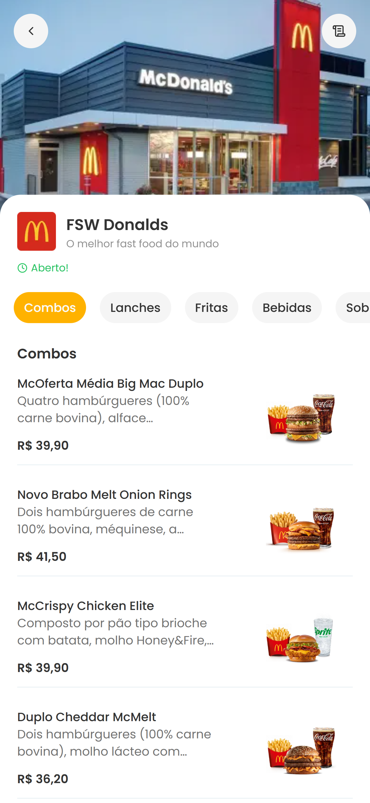
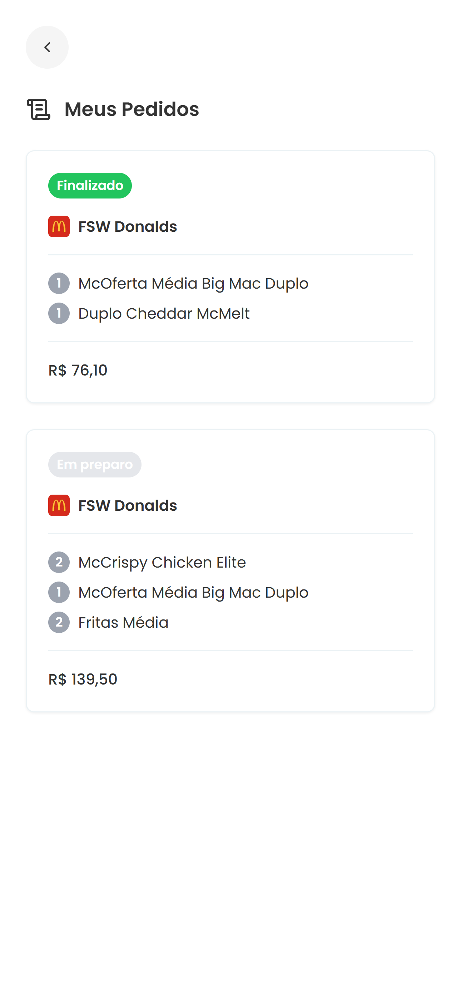

<h1 align="center">
  Fullstackweek Donalds
</h1>

  
  
  
  
  
  
  
  

  

  

  

  

## 💻 Projeto

Projeto produzido na semana Full Stack Week, fazendo um app de compra de lanches online, com um carrinho e lista de pedidos salvos em um banco de dados.

[Ver Projeto](https://music-player-react-amber.vercel.app/)

## 🚀 Tecnologias

- HTML
- Tailwind Css
- TypeScript
- React
- Next
- Prisma

## 📔 Conhecimentos fortalecidos

- [x] Componentização no React.
- [x] Next.
- [x] O uso dos principais hooks.
- [x] Props.
- [x] Um pouco de Prisma na criacao das tabelas e seu uso.
- [x] Neon Postgres .

## 💻 Imagens mobile

  
  

